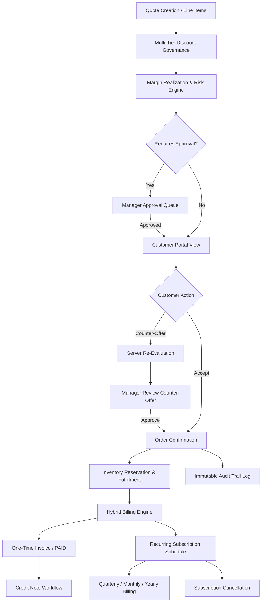
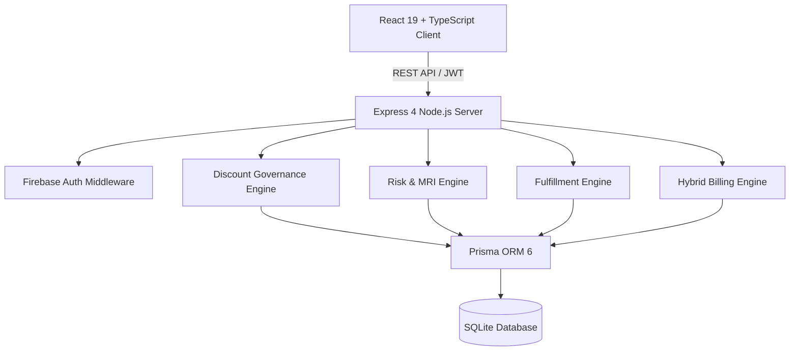

# 🚦 DealFlow360 — Commercial Sales Governance Engine

> **Don't just manage deals. Govern whether they're commercially safe to move forward.**

DealFlow360 is a closed-loop commercial governance layer that connects discount policy, margin, risk, approval, negotiation, fulfillment, billing, payment, and audit into a single enforced lifecycle.

[](https://github.com/abdul05kh/DealFlow360/actions/workflows/ci.yml)


> ### 🎯 Core Business Question
> **Is this deal commercially safe to move forward?**
>
> Conventional CRM and CPQ tools treat deal approval as a one-time gate before proposal. DealFlow360 continuously evaluates commercial safety across every stage — from quote creation and customer negotiation to stock allocation, recurring billing, and credit issuance.

---

## 🧭 Navigation Index

- [Executive Overview](#executive-overview)
- [The Problem](#the-problem)
- [The Solution](#the-solution)
- [End-to-End Deal Lifecycle](#end-to-end-deal-lifecycle)
- [Key Capabilities](#key-capabilities)
- [Personas & Access Control](#personas--access-control)
- [Architecture](#architecture)
- [Technology Stack](#technology-stack)
- [Verified Engineering Quality](#verified-engineering-quality)
- [Quick Start Guide](#quick-start-guide)
- [Engineering Trade-Offs](#engineering-trade-offs)
- [Release Baseline Status](#release-baseline-status)
- [Future Enterprise Roadmap](#future-enterprise-roadmap)

---

## Executive Overview

Standard sales management software focuses on pipeline velocity — moving deals through stages regardless of financial erosion. **DealFlow360** introduces an automated governance layer that evaluates line-item discounting, margin realization, warehouse SLAs, and subscription run rates in real time.

By enforcing policy server-side via Node.js/Express and Prisma, DealFlow360 prevents rep bypasses, protects warehouse inventory, governs price counter-offers, and ensures zero floating-point currency drift across hybrid recurring billing models.

---

## The Problem

| Business Risk | What Goes Wrong in Standard Sales Tools |
| :--- | :--- |
| **Uncontrolled Discounting** | Reps issue steep discounts to close deals fast, eroding gross margin without manager visibility. |
| **Static Ceiling Flaws** | Standard discount limits ignore customer tier, product category, and volume context. |
| **Fulfillment Blind Spots** | Quotes get approved for items out of stock or impossible to deliver within customer SLA. |
| **Negotiation Drift** | Verbal price adjustments during negotiation bypass commercial policy and auditing. |
| **Billing Complexity** | Mixing one-time hardware fees with recurring subscriptions causes run-rate errors and rounding drift. |

---

## The Solution

| Control Layer | Purpose & Server-Side Mechanism |
| :--- | :--- |
| 🛡️ **Discount Governance** | Enforces tier-based and category-based discount ceilings before quote submission. |
| 📊 **Margin & Risk** | Computes Margin Realization Index (MRI) and multi-factor commercial risk score. |
| 🔐 **Approval State Machine** | Dynamically locks policy-violating quotes until appropriate manager role approves. |
| 🤝 **Negotiation Portal** | Evaluates customer counter-offers server-side without exposing internal cost or margin metrics. |
| 📦 **Fulfillment Engine** | Checks multi-warehouse inventory, logs backorders, and acquires concurrency locks. |
| 💳 **Hybrid Billing** | Separates one-time invoices (`ISSUED` $\rightarrow$ `PAID`) from recurring subscriptions (`MONTHLY`, `QUARTERLY`, `YEARLY`). |
| 🧾 **Credit & Cancellation** | Manages internal subscription cancellation (`ACTIVE` $\rightarrow$ `CANCELLED`) and capped credit notes. |
| 📋 **Audit Engine** | Generates an immutable event log for every approval, counter-offer, payment, and credit note. |

---

## End-to-End Deal Lifecycle



---

## Key Capabilities

### 🛡️ Multi-Tier Discount Governance
Enforces hierarchical discount ceilings tailored to customer tier (`BRONZE`, `SILVER`, `GOLD`, `PLATINUM`, `ENTERPRISE`) and product category limits. Attempts to bypass tier ceilings automatically trigger mandatory managerial approval routing.

### 📊 Risk Engine & Margin Realization Index (MRI)
Calculates a weighted commercial Risk Score (`LOW`, `MEDIUM`, `HIGH`, `CRITICAL`) based on discount percentage, margin erosion, customer tier, and contract term. Evaluates the **Margin Realization Index (MRI)**:
$$\text{Realized Margin \%} = \frac{\text{Net Revenue} - \text{Total Cost}}{\text{Net Revenue}}$$
$$\text{MRI \%} = \frac{\text{Realized Margin \%}}{\text{Required Target Margin \%}} \times 100$$

### 🤝 Customer Negotiation Portal
Provides an isolated workspace where customers review proposals, accept terms, or submit price counter-offers. Submissions trigger server-side policy re-evaluation without exposing sensitive internal margins or cost structures.

### 📦 Multi-Warehouse Fulfillment & Inventory Reservation
Evaluates stock availability across distribution hubs (`HUB_EAST`, `HUB_WEST`, `HUB_CENTRAL`). Allocates split shipments, tracks backorders, verifies delivery SLA feasibility, and uses database transaction locks to prevent inventory overbooking under concurrent requests.

### 💳 Hybrid Recurring Billing & Payment Engine
Handles mixed carts by separating one-time setup/equipment charges from recurring service plans. Supports `MONTHLY`, `QUARTERLY` (3-month), and `YEARLY` billing intervals. Manages payment status transitions (`ISSUED` $\rightarrow$ `PAID`), subscription cancellations (`ACTIVE` $\rightarrow$ `CANCELLED`), and transactional credit notes with eligible invoice balance caps.

### 🧾 Operational Reporting & Exports
Features canonical dataset filtering by date range, sales representative, approval status, and product category. Exports genuine binary `.xlsx` workbooks via SheetJS and styled print-ready PDF documents.

---

## Personas & Access Control

| Persona | Role | Key Responsibilities |
| :--- | :--- | :--- |
| **Sales Rep** | `SALES_REP` | Create quotes, select items, evaluate risk, submit quotes for manager approval. |
| **Sales Manager** | `SALES_MANAGER` | Review flagged quotes, inspect margin impact, approve/reject discount overrides & counter-offers. |
| **Operations Manager** | `OPERATIONS_MANAGER` | Monitor warehouse allocation, inspect fulfillment SLAs, manage subscriptions, issue credit notes. |
| **Customer** | `CUSTOMER` | View safe commercial quotes, accept terms, or submit counter-offers via isolated portal. |
| **Admin** | `ADMIN` | Manage master data (230 products, customer tiers), configure approval rules, audit system events. |

---

## Architecture



### Technology Stack

| Layer | Technology | Description |
| :--- | :--- | :--- |
| **Frontend** | React 19, TypeScript 5.7, Vite 7.3 | Modern SPA with Vanilla CSS design system, Lucide icons, and SheetJS export |
| **Backend** | Node.js 20, Express 4.21, Zod | Type-safe REST API with strict runtime payload validation |
| **Authentication** | Firebase Admin SDK, JWT | Role-based route protection and customer tenant isolation |
| **Database & ORM** | SQLite 3, Prisma 6.3 | Relational database schema with transactional locks |
| **Testing & Quality** | Vitest 3.2, Supertest | Unit, integration, concurrency, and performance smoke testing |
| **CI/CD** | GitHub Actions | Automated build, typecheck, seed, and test workflow |
| **Exports** | SheetJS (`xlsx`) | Genuine binary `.xlsx` spreadsheet workbook generation |

---

## 🧪 Verified Engineering Quality

### Automated Test Suite Baseline
**175 / 175 Tests Passing · 17 Test Files (100% Pass Rate)**

| Test Category | File Count / Scope | Key Coverage Areas |
| :--- | :---: | :--- |
| **Governance & MRI** | 4 Files | Discount ceilings, category rules, MRI calculation, target threshold updates |
| **Fulfillment & Concurrency**| 2 Files | Warehouse allocation, stock deduction, SLA checks, concurrent reservation locks |
| **Hybrid Billing & Payments**| 1 File | One-time invoices, quarterly/monthly subscriptions, payment `ISSUED` $\rightarrow$ `PAID`, cancellation, credit notes |
| **Customer Negotiation** | 1 File | Counter-offer evaluation, manager counter-offer approval, quote state preservation |
| **Security & Auth (RBAC)** | 2 Files | Safe password hashes, route gating, customer tenant isolation, anti-tampering |
| **Master Data & Admin** | 1 File | Product search, tier limit updates, role assignment |
| **Performance Smoke Suite**| 1 File | Bounded product search, auth latency, quote evaluation speed |
| **Foundation & System Rules**| 5 Files | Domain math, risk engine, margin calculator, recommendation engine |

### Verified Local Latency Metrics

| Operation | Verified Local Latency | Performance Note |
| :--- | ---: | :--- |
| **Product Search** (230 products) | **~56 ms** | Results bounded to maximum 5 visible items with scrollable UI |
| **Customer List** (6 customers) | **~38 ms** | Fast tenant lookup across enterprise accounts |
| **Quote Evaluation** | **~30 ms** | Real-time discount governance and MRI calculation |
| **User Authentication** | **~91 ms** | Firebase Admin SDK token verification |
| **Fulfillment Evaluation** | **~8.5 ms** | Multi-warehouse stock availability and SLA calculation |

> *Note: These are local smoke/verification measurements on standard developer hardware, not universal production benchmarks.*

---

## Quick Start Guide

### Prerequisites
- **Node.js**: v20.x or higher
- **npm**: v10.x or higher

### Setup Commands

1. **Clone & Install**:
   ```bash
   git clone https://github.com/abdul05kh/DealFlow360.git
   cd DealFlow360
   npm install
   ```

2. **Database Migration & Seed**:
   ```bash
   npm run db:migrate
   npm run db:seed
   ```

3. **Start Development Servers (Backend + Frontend)**:
   ```bash
   npm run dev:all
   ```
   - Frontend UI: `http://localhost:3000`
   - Backend API: `http://localhost:3001`

4. **Run Automated Test Suite**:
   ```bash
   npm test
   ```

5. **Build Production Bundle**:
   ```bash
   npm run build
   ```

---

## Engineering Trade-Offs

To maximize reviewer confidence and financial arithmetic determinism, specific deliberate scope choices were made:

- **Integer Minor-Unit Money Arithmetic**: All financial amounts (`totalMinor`, `amountMinor`, `runRateMinor`) are strictly stored as integer minor units (e.g., ₹100.00 stored as `10000`). Floating-point currency math was intentionally forbidden to eliminate rounding drift.
- **Internal Payment & Credit Workflows**: Invoices transition `ISSUED` $\rightarrow$ `PAID` via authenticated internal service endpoints. Credit notes are issued transactionally against invoice balances. External payment gateways (Stripe) and external bank refund webhooks were excluded to eliminate third-party API availability risks.
- **Fixed Subscription Schedules**: Added support for `MONTHLY`, `QUARTERLY` (3-month), and `YEARLY` intervals. Mid-cycle proration formulas were intentionally excluded to preserve billing snapshot determinism.
- **SQLite Database**: Selected for zero-config portability and instant GitHub CI execution without requiring external database container services.

---

## Release Baseline Status

| Check | Status | Verification Command / Details |
| :--- | :---: | :--- |
| **Automated Tests** | ✅ **175 / 175 PASSED** | `npm test` across 17 test files |
| **Server Typecheck** | ✅ **PASS** | `npx tsc -p server/tsconfig.json --noEmit` |
| **Client Typecheck** | ✅ **PASS** | `npx tsc -p client/tsconfig.json --noEmit` |
| **Production Build** | ✅ **PASS** | `npm run build` (Vite v7.3.6 bundle) |
| **Git Diff Hygiene** | ✅ **PASS** | `git diff --check` |
| **GitHub Actions CI**| ✅ **GREEN** | Validated on `origin/main` branch |
| **Application Code**| 🔒 **FROZEN** | Production baseline locked at commit `3aa6e4a` |

---

## Future Enterprise Roadmap

- **Mid-Cycle Subscription Proration**: Formulaic line-item proration for mid-term seat upgrades or plan tier switches.
- **Payment Gateway Adapters**: Webhook adapters for external payment providers (Stripe / Razorpay).
- **Macro Analytics Dashboard**: Historical margin erosion trends across sales teams and fiscal quarters.
- **Automated Stalled-Deal Nudging**: Time-based escalation rules for quotes pending manager review > 48 hours.

---

## 🚀 DealFlow360

> **A deal should not merely be created. It should be evaluated, approved, fulfilled, billed, paid, and auditable.**

<div align="center">

**Built for the Odoo Hackathon 2026 · Team #98**

</div>
