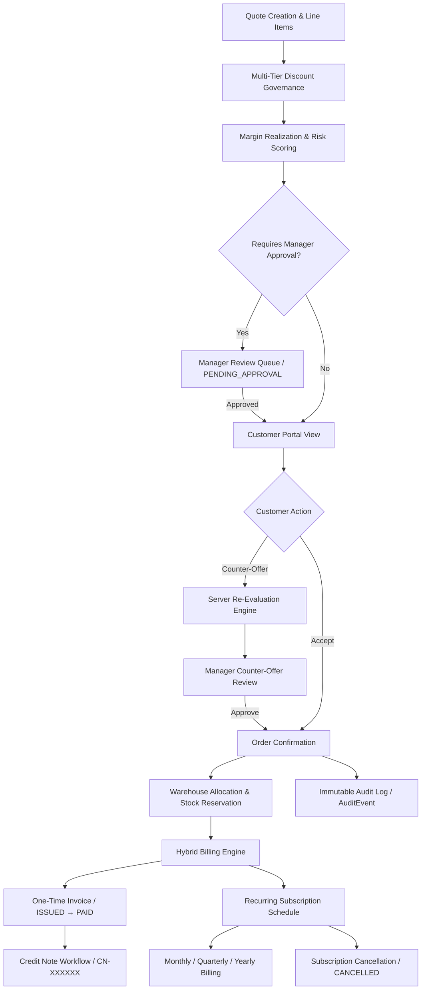
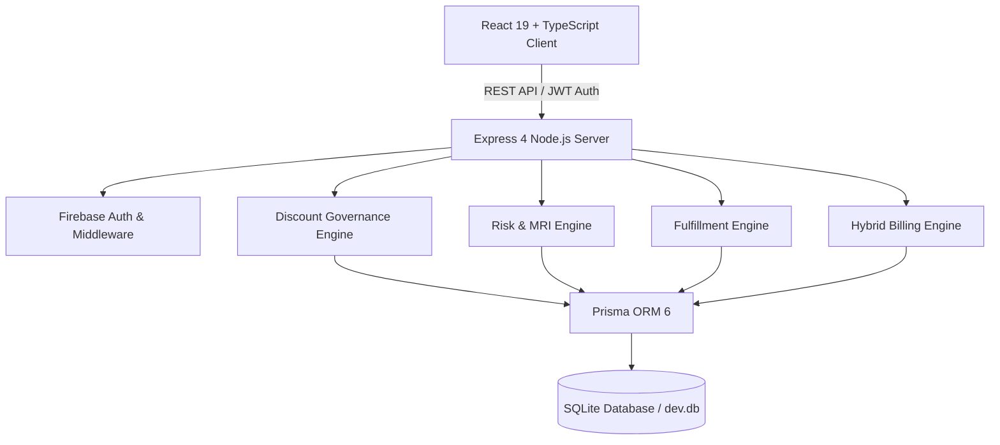

# 🚦 DealFlow360 — Commercial Sales Governance Engine

> **Don't just manage deals. Govern whether they're commercially safe to move forward.**

DealFlow360 is a closed-loop commercial sales governance engine that integrates discount policy, margin realization, risk scoring, managerial approval state machines, customer price negotiation, multi-warehouse fulfillment, hybrid recurring billing, payment recording, and immutable audit logging into a single server-enforced lifecycle.

<div align="left">

[](https://github.com/abdul05kh/DealFlow360/actions/workflows/ci.yml)


</div>

> ### 🎯 Core Business Question
> **Is this deal commercially safe to move forward?**
>
> Standard CRM and CPQ tools treat approval as a static pre-proposal step. DealFlow360 continuously evaluates commercial risk across every stage of the sales pipeline — from quote generation and customer counter-offers to warehouse allocation, recurring billing schedules, and credit note issuance.

---

## 🧭 Navigation Index

- [Executive Overview](#executive-overview)
- [The Problem](#the-problem)
- [The Solution](#the-solution)
- [End-to-End Deal Lifecycle](#end-to-end-deal-lifecycle)
- [Key Capabilities](#key-capabilities)
- [Personas & Access Control](#personas--access-control)
- [Architecture](#architecture)
- [Technology Stack](#technology-stack)
- [Verified Engineering Quality](#verified-engineering-quality)
- [Quick Start Guide](#quick-start-guide)
- [Engineering Trade-Offs](#engineering-trade-offs)
- [Release Baseline Status](#release-baseline-status)
- [Future Enterprise Roadmap](#future-enterprise-roadmap)

---

## Executive Overview

Standard sales management software focuses on pipeline velocity — moving deals through stages regardless of financial erosion. **DealFlow360** introduces an automated governance layer that evaluates line-item discounting, margin realization, warehouse SLAs, and subscription run rates in real time.

By enforcing policy server-side via Node.js/Express and Prisma, DealFlow360 prevents rep bypasses, protects warehouse inventory, governs price counter-offers, and ensures zero floating-point currency drift across hybrid recurring billing models.

---

## The Problem

In modern B2B enterprise sales, revenue leakage occurs silently across fragmented disconnects between sales, finance, and operations:

| Commercial Risk | Traditional Sales System Failure Mode | DealFlow360 Impact |
| :--- | :--- | :--- |
| **Uncontrolled Discounting** | Sales reps issue steep line-item discounts to close deals fast, eroding gross margin without manager visibility. | Server-side policy validation blocks unapproved discount overrides before quote issuance. |
| **Static Ceiling Flaws** | Standard CPQ systems use flat discount limits that ignore customer tier, product margin, and deal volume context. | Hierarchical governance evaluates tier ceilings (`BRONZE` $\rightarrow$ `ENTERPRISE`) and product category rules dynamically. |
| **Fulfillment Blind Spots** | Quotes get approved for out-of-stock items or delivery schedules that violate customer SLAs. | Multi-warehouse inventory engine checks stock availability across hubs (`HUB_EAST`, `HUB_WEST`) and acquires stock locks. |
| **Negotiation Drift** | Verbal price adjustments during price negotiations occur off-system, bypassing commercial policy and audit logs. | Customer negotiation portal evaluates counter-offers server-side and routes policy deviations for re-approval. |
| **Billing Complexity** | Mixing one-time equipment fees with recurring subscriptions leads to run-rate errors and floating-point currency drift. | Integer minor-unit arithmetic separates one-time invoices (`ISSUED` $\rightarrow$ `PAID`) from recurring subscription run rates. |

---

## The Solution

DealFlow360 transforms ungoverned sales activity into **governed commercial execution**.

Every deal evaluated by DealFlow360 passes through an automated, server-enforced governance pipeline:

| Control Layer | Core Governance Module | Server-Side Enforcement Mechanism |
| :--- | :--- | :--- |
| 🛡️ **Discount Governance** | Multi-Tier Policy Engine | Validates line-item and overall discounts against tier ceilings (`BRONZE` $\rightarrow$ `ENTERPRISE`) and category rules. |
| 📊 **Margin & Risk** | Margin Realization Index (MRI) | Computes realized margin vs. required volume target and generates a weighted Risk Score (`LOW` $\rightarrow$ `CRITICAL`). |
| 🔐 **Approval Routing** | Managerial State Machine | Locks policy-violating quotes in `PENDING_APPROVAL` status until an authorized role (`SALES_MANAGER`) approves. |
| 🤝 **Customer Negotiation** | Isolated Customer Portal | Evaluates price counter-offers server-side and routes policy-exceeding counter-offers back for manager review. |
| 📦 **Fulfillment Engine** | Inventory Allocation | Verifies stock availability across warehouses, tracks backorders, and acquires database transaction locks. |
| 💳 **Hybrid Billing** | Integer Run-Rate Engine | Separates one-time charges (`ISSUED` $\rightarrow$ `PAID`) from recurring subscriptions (`MONTHLY`, `QUARTERLY`, `YEARLY`). |
| 🧾 **Credit & Cancellation** | Financial Lifecycle Engine | Enforces `ACTIVE` $\rightarrow$ `CANCELLED` subscription transitions and issues transactional credit notes capped to invoice balances. |
| 📋 **Audit Engine** | Immutable Audit Trail | Generates persistent `AuditEvent` records with timestamp, actor ID, and exact state delta for every critical action. |

---

## End-to-End Deal Lifecycle



---

## Key Capabilities

### 🛡️ Multi-Tier Discount Governance
Enforces hierarchical discount ceilings tailored to customer tier (`BRONZE`, `SILVER`, `GOLD`, `PLATINUM`, `ENTERPRISE`) and product category limits. Attempts to bypass tier ceilings automatically trigger mandatory managerial approval routing before proposal generation.

### 📊 Risk Engine & Margin Realization Index (MRI)
Calculates a weighted commercial Risk Score (`LOW`, `MEDIUM`, `HIGH`, `CRITICAL`) based on discount percentage, margin erosion, customer tier, and contract term. Evaluates the **Margin Realization Index (MRI)**:
$$\text{Realized Margin \%} = \frac{\text{Net Revenue} - \text{Total Cost}}{\text{Net Revenue}}$$
$$\text{MRI \%} = \frac{\text{Realized Margin \%}}{\text{Required Target Margin \%}} \times 100$$

### 🤝 Customer Negotiation Portal
Provides a customer-isolated workspace where clients view commercial proposals, accept terms, or submit price counter-offers. Counter-offer submissions trigger automated server-side policy re-evaluation without exposing sensitive internal cost prices or margin structures.

### 📦 Multi-Warehouse Fulfillment & Stock Reservation
Evaluates stock availability across distribution hubs (`HUB_EAST`, `HUB_WEST`, `HUB_CENTRAL`). Allocates split shipments, tracks backorders, verifies delivery SLA feasibility, and acquires database transaction locks to prevent inventory overbooking under concurrent requests.

### 💳 Hybrid Recurring Billing & Payment Engine
Handles mixed carts by separating one-time setup/equipment charges from recurring service plans. Supports `MONTHLY`, `QUARTERLY` (3-month), and `YEARLY` billing intervals. Manages payment status transitions (`ISSUED` $\rightarrow$ `PAID`) via authenticated service calls.

### 🧾 Subscription Cancellation & Credit Notes
Implements minimal internal financial lifecycle controls: subscription cancellation (`ACTIVE` $\rightarrow$ `CANCELLED`) with duplicate protection, and transactional credit note creation (`CN-XXXXXX`) capped to eligible invoice balances.

### 📈 Operational Reporting & Exports
Features canonical dataset filtering by date range, sales representative, approval status, and product category. Exports genuine binary `.xlsx` workbooks via SheetJS and styled print-ready PDF documents.

### 🔐 Security & Auditability
Enforces server-side Role-Based Access Control (RBAC), tenant isolation, strict Zod schema payload validation, integer minor-unit money math, and persistent audit trail recording (`AuditEvent`).

---

## Personas & Access Control

| Persona | Role | Key Responsibilities |
| :--- | :--- | :--- |
| **Sales Rep** | `SALES_REP` | Create quotes, select items, evaluate risk, submit quotes for manager approval. |
| **Sales Manager** | `SALES_MANAGER` | Review flagged quotes, inspect margin impact, approve/reject discount overrides & counter-offers. |
| **Operations Manager** | `OPERATIONS_MANAGER` | Monitor warehouse allocation, inspect fulfillment SLAs, manage subscriptions, issue credit notes. |
| **Customer** | `CUSTOMER` | View safe commercial quotes, accept terms, or submit counter-offers via isolated portal. |
| **Admin** | `ADMIN` | Manage master data (230 products, customer tiers), configure approval rules, audit system events. |

---

## Architecture



### Technology Stack

| Layer | Technology | Purpose & Implementation Details |
| :--- | :--- | :--- |
| **Frontend UI** | React 19, TypeScript 5.7, Vite 7.3 | Single-page application with custom Vanilla CSS tokens, Lucide icons, and state management. |
| **Backend API** | Node.js 20, Express 4.21, Zod | Type-safe REST endpoints with strict runtime Zod payload validation and domain engines. |
| **Authentication** | Firebase Admin SDK, JWT | Server-verified auth tokens, role-based route guards, and customer tenant isolation. |
| **Database & ORM** | SQLite 3, Prisma 6.3 | Relational schema with foreign keys, indexes, transaction blocks, and stock reservation locks. |
| **Testing Framework** | Vitest 3.2, Supertest | Comprehensive unit, API integration, concurrency, and performance smoke test suite. |
| **CI / CD Pipeline** | GitHub Actions | Automated lint, build, server/client typecheck, master data seed, and test workflow. |
| **Document Export** | SheetJS (`xlsx`), Window Print | Client-side genuine binary `.xlsx` spreadsheet workbook streaming and styled printable PDF views. |

---

## 🧪 Verified Engineering Quality

### Automated Test Suite Baseline
**175 / 175 Tests Passing · 17 Test Files (100% Pass Rate)**

| Test Suite Category | File Scope | Key Policy & System Verification Coverage |
| :--- | :---: | :--- |
| **Discount Governance & MRI** | 4 Files | Tier ceilings (`BRONZE` $\rightarrow$ `ENTERPRISE`), category limits, MRI calculation, target threshold updates |
| **Warehouse Fulfillment & Concurrency**| 2 Files | Multi-hub allocation, stock deduction, SLA checks, database transaction locks under load |
| **Hybrid Billing, Payments & Subscriptions**| 1 File | One-time fees vs. subscriptions, payment `ISSUED` $\rightarrow$ `PAID`, cancellation, credit note caps |
| **Customer Negotiation Portal** | 1 File | Counter-offer re-evaluation, manager counter-offer decision, quote state preservation |
| **Security & Authorization (RBAC)** | 2 Files | Safe password hashes, role gating, customer tenant isolation, anti-tampering |
| **Master Data & Admin Controls** | 1 File | Bounded product search (230 products), customer tier limit updates, operator role assignment |
| **Performance Smoke Suite** | 1 File | Search response latency, auth check speed, quote evaluation execution timing |
| **Foundation & Domain Rules** | 5 Files | Integer minor-unit math, risk engine scoring, margin calculator, recommendation engine |

### Verified Local Latency Metrics

| Core Operation | Dataset Scale | Verified Local Latency | Performance Engineering Note |
| :--- | :--- | ---: | :--- |
| **Product Search** | 230 Catalog Products | **~56 ms** | Bounded search results (max 5 visible items rendered with scrollable UI) |
| **Customer List** | 6 Seeded Enterprise Accounts | **~38 ms** | Indexed database query for rapid tenant lookup |
| **Quote Evaluation** | Real-time Governance Engine | **~30 ms** | Authoritative server-side discount policy & MRI calculation |
| **User Authentication** | Firebase Admin SDK + JWT | **~91 ms** | Token verification and user role extraction |
| **Fulfillment Evaluation** | 3 Distribution Hubs | **~8.5 ms** | SLA feasibility check and warehouse inventory allocation |

> *Note: These latency numbers are verified local smoke/performance measurements executed on standard developer hardware, not universal production SLA guarantees.*

---

## Quick Start Guide

### Prerequisites
- **Node.js**: v20.x or higher
- **npm**: v10.x or higher

### Environment Configuration
Default local development uses safe local defaults configured in `.env` (SQLite `dev.db` and development JWT secrets). No external cloud credentials are required to execute local tests or run dev servers.

### Step-by-Step Installation

1. **Clone Repository & Install Dependencies**:
   ```bash
   git clone https://github.com/abdul05kh/DealFlow360.git
   cd DealFlow360
   npm install
   ```

2. **Migrate Database & Seed Master Data**:
   ```bash
   npm run db:migrate
   npm run db:seed
   ```

3. **Start Development Servers (Server & Client)**:
   ```bash
   npm run dev:all
   ```
   - **Client App**: `http://localhost:3000`
   - **Server API**: `http://localhost:3001`

4. **Execute Automated Test Suite**:
   ```bash
   npm test
   ```

5. **Build Production Application**:
   ```bash
   npm run build
   ```

---

## Engineering Trade-Offs & Scope Decisions

To maximize reviewer confidence, financial arithmetic determinism, and system stability during hackathon evaluation, specific architectural decisions were made:

### 🪙 Integer Minor-Unit Money Arithmetic
All monetary values (`totalMinor`, `amountMinor`, `runRateMinor`) are strictly computed and stored as integer minor units (e.g., ₹100.00 stored as `10000`). Floating-point currency math was intentionally forbidden across backend services to eliminate floating-point rounding drift.

### 🗄️ SQLite Database Selection
SQLite 3 was chosen for zero-configuration portability, instant GitHub Actions CI workflow setup, and fast transactional locks without external database container service overhead.

### 💳 Internal Payment & Credit Note Workflows
Invoices transition `ISSUED` $\rightarrow$ `PAID` via authenticated internal service calls. Credit notes are issued transactionally against invoice balances. External payment gateways (Stripe) and external bank refund webhooks were excluded to eliminate third-party API availability risks.

### 📅 Fixed Recurring Subscription Schedules
Supports `MONTHLY`, `QUARTERLY` (3-month), and `YEARLY` intervals. Mid-cycle proration math was intentionally excluded to preserve billing snapshot determinism and protect core financial accounting integrity.

---

## 🚀 Release Baseline Status

The current release baseline has been fully verified against automated test suites and GitHub Actions CI:

| Quality Verification Gate | Verified Result | Execution Command / Details |
| :--- | :---: | :--- |
| **Automated Test Suite** | ✅ **175 / 175 PASSED** | `npm test` across 17 test files |
| **Server TypeScript Check** | ✅ **PASS** | `npx tsc -p server/tsconfig.json --noEmit` |
| **Client TypeScript Check** | ✅ **PASS** | `npx tsc -p client/tsconfig.json --noEmit` |
| **Production Bundle Build** | ✅ **PASS** | `npm run build` (Vite v7.3.6 bundle) |
| **Code Hygiene Check** | ✅ **PASS** | `git diff --check` |
| **GitHub Actions CI** | ✅ **GREEN** | Validated workflow on `origin/main` branch |
| **Application Codebase** | 🔒 **FROZEN** | Production baseline locked at commit `3aa6e4a` |

---

## Future Enterprise Roadmap

- **Mid-Cycle Subscription Proration**: Formulaic line-item proration for mid-term seat upgrades or plan tier switches.
- **Payment Gateway Adapters**: Webhook adapters for external payment providers (Stripe / Razorpay).
- **Macro Analytics Dashboard**: Historical margin erosion trends across sales teams and fiscal quarters.
- **Automated Stalled-Deal Nudging**: Time-based escalation rules for quotes pending manager review > 48 hours.

---

## 🚀 DealFlow360

> **A deal should not merely be created. It should be evaluated, approved, fulfilled, billed, paid, and auditable.**

<div align="center">

**Built for the Odoo Hackathon 2026 · Team #98**

</div>
