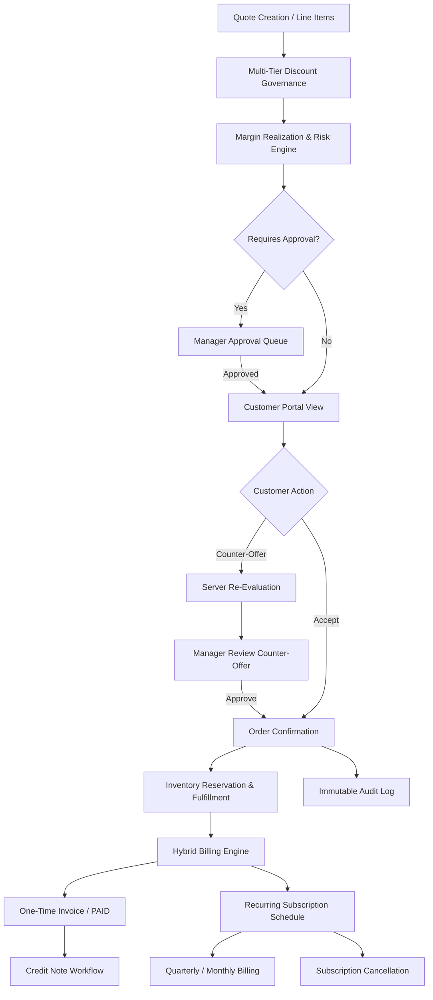
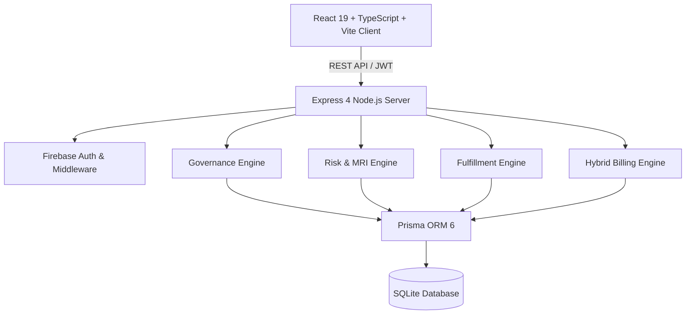

# DealFlow360

### Deal Governance Engine for Commercially Safe Sales Execution

> Don't just manage deals. Govern whether they're commercially safe to move forward.

[](https://github.com/abdul05kh/DealFlow360/actions/workflows/ci.yml)


---

## 1. Executive Overview

**DealFlow360** is a closed-loop commercial sales governance engine designed to enforce commercial policy, risk boundaries, margin realization, fulfillment SLAs, and hybrid billing rules throughout the entire B2B sales lifecycle.

Conventional CRM and CPQ tools allow sales representatives to create, discount, and push deals into commitment without validating whether the transaction is commercially safe for the business. **DealFlow360** sits directly on top of the deal pipeline as an active governance layer — evaluating commercial risk in real time, routing required approvals dynamically, protecting warehouse stock, managing customer counter-negotiations, and executing precise hybrid recurring billing and credit workflows.

---

## 2. The Problem

In modern B2B sales operations, revenue leakage occurs quietly across multiple disconnects:

- **Uncontrolled Discounting**: Reps give steep discounts to close deals fast, eroding gross margin without manager visibility.
- **Static Ceiling Flaws**: Standard discount limits ignore customer tier, product category, and deal volume nuances.
- **Fulfillment blind spots**: Quotes get approved for items out of stock or impossible to deliver within customer SLA.
- **Customer Negotiation Drift**: Reps make off-system verbal commitments during price counter-offers.
- **Billing Integrity Errors**: Recurring subscription schedules mixed with one-time line items lead to floating-point currency drift, incorrect run rates, and improper credit note issuance.

---

## 3. The Solution

**DealFlow360** turns sales execution into **governed commercial execution**.

Every deal evaluated by DealFlow360 passes through an automated, server-side governance pipeline:
1. **Multi-Factor Discount Engine**: Validates line-item discounts against customer tier ceilings and product category rules.
2. **Margin Realization Index (MRI)**: Computes realized margin percentage against required target margin for the deal volume.
3. **Dynamic Risk Engine**: Generates a weighted commercial risk score (`LOW`, `MEDIUM`, `HIGH`, `CRITICAL`).
4. **Approval Routing State Machine**: Enforces required approval roles (`SALES_MANAGER`, `FINANCE_MANAGER`) before order confirmation.
5. **Customer Counter-Offer Portal**: Allows customers to negotiate terms within governed boundaries, triggering automated policy re-evaluations.
6. **Concurrency-Safe Fulfillment Engine**: Checks multi-warehouse inventory, reserves stock, handles backorders, and tracks shipments.
7. **Hybrid Recurring Billing Engine**: Manages one-time invoices (`ISSUED` $\rightarrow$ `PAID`), recurring subscriptions (`MONTHLY`, `QUARTERLY`, `YEARLY`), cancellation, and transactional credit notes.

---

## 4. End-to-End Deal Lifecycle



---

## 5. Key Capabilities

### 🛡️ Multi-Tier Discount Governance
Enforces hierarchical discount rules based on customer tier (`BRONZE`, `SILVER`, `GOLD`, `PLATINUM`, `ENTERPRISE`) and product category ceilings. Attempts to bypass tier ceilings automatically trigger mandatory managerial approval.

### 📊 Risk Engine & Margin Realization Index (MRI)
Calculates a comprehensive Risk Score based on overall discount, margin erosion, customer tier, and contract term. Evaluates the **Margin Realization Index (MRI)**:
$$\text{Realized Margin \%} = \frac{\text{Net Revenue} - \text{Total Cost}}{\text{Net Revenue}}$$
$$\text{MRI \%} = \frac{\text{Realized Margin \%}}{\text{Required Target Margin \%}} \times 100$$

### 🤝 Customer Negotiation Portal
Provides a customer-isolated portal where clients view quotes, request line-item adjustments, or submit price counter-offers. Submissions undergo instant server-side re-evaluation without exposing internal cost or governance metrics to the customer.

### 📦 Multi-Warehouse Fulfillment & Stock Reservation
Evaluates stock availability across distribution hubs (`HUB_EAST`, `HUB_WEST`, `HUB_CENTRAL`). Allocates split shipments, logs backorders, enforces delivery SLA feasibility, and prevents overbooking via concurrency-safe database locks.

### 💳 Hybrid Recurring Billing & Payment Engine
Handles mixed cart billing by separating one-time hardware/setup fees from recurring software/service subscriptions. Supports `MONTHLY`, `QUARTERLY` (3-month), and `YEARLY` intervals with precise integer minor-unit arithmetic. Includes payment recording (`ISSUED` $\rightarrow$ `PAID`), subscription cancellation (`ACTIVE` $\rightarrow$ `CANCELLED`), and credit notes.

---

## 6. System Personas & Access Control

| Persona | Role Code | Key Responsibilities |
| :--- | :--- | :--- |
| **Sales Rep** | `SALES_REP` | Create quotes, configure line items, evaluate risk, submit quotes for manager approval. |
| **Sales Manager** | `SALES_MANAGER` | Review flagged quotes, inspect margin impact, approve/reject discount overrides & counter-offers. |
| **Operations Manager** | `OPERATIONS_MANAGER` | Monitor warehouse allocation, review fulfillment SLAs, manage subscriptions, issue credit notes. |
| **Customer** | `CUSTOMER` | View safe commercial quotes, accept terms, or submit counter-offers via isolated portal. |
| **Admin** | `ADMIN` | Manage master data (230 products, customer tiers), configure approval rules, audit overall governance. |

---

## 7. Architecture & Tech Stack



### Technology Stack
- **Frontend**: React 19, TypeScript 5.7, Vite 7.3, Vanilla CSS Design System, Lucide Icons, SheetJS (`xlsx`) Export.
- **Backend**: Node.js 20, Express 4.21, TypeScript 5.7, Zod Validation, Firebase Admin SDK.
- **Database & ORM**: SQLite 3, Prisma ORM 6.3.
- **Testing & Quality**: Vitest 3.2, Supertest, GitHub Actions CI.

---

## 8. Verified Performance & Test Baseline

All performance and test measurements are backed by the automated test suite and CI validation:

```
================================================================================
AUTOMATED TEST SUITE: 175 / 175 PASSED (17 Test Files)
================================================================================
✓ Discount Governance & Tier Ceilings      (4 tests)
✓ Margin Realization Index (MRI) Engine     (7 tests)
✓ Multi-Factor Risk Engine Evaluation      (4 tests)
✓ Approval Routing State Machine           (6 tests)
✓ Multi-Warehouse Fulfillment & Concurrency (26 tests)
✓ Customer Negotiation & Counter-Offers    (7 tests)
✓ Hybrid Billing, Payments & Subscriptions (30 tests)
✓ Master Data & Admin Management           (15 tests)
✓ Real Authentication & Security (RBAC)    (21 tests)
✓ Performance Smoke Tests                  (5 tests)
✓ Foundation & System Rules                (50 tests)
================================================================================
```

### Local Verification Latency Metrics (Smoke Suite)
- **Product Search Latency** (230 products, bounded top 5): **~56 ms**
- **Customer List Latency** (6 seeded customers): **~38 ms**
- **Quote Evaluation Latency** (Governance check): **~30 ms**
- **Authentication Latency** (Firebase auth check): **~91 ms**
- **Fulfillment Evaluation Latency** (Stock allocation): **~8.5 ms**

---

## 9. Quick Start Guide

### Prerequisites
- **Node.js**: v20.x or higher
- **npm**: v10.x or higher

### Installation & Setup

1. **Clone the repository**:
   ```bash
   git clone https://github.com/abdul05kh/DealFlow360.git
   cd DealFlow360
   ```

2. **Install workspace dependencies**:
   ```bash
   npm install
   ```

3. **Initialize Database & Seed Master Data**:
   ```bash
   npm run db:migrate
   npm run db:seed
   ```

4. **Launch Application (Server + Client)**:
   ```bash
   npm run dev:all
   ```
   - **Frontend UI**: `http://localhost:3000`
   - **Backend API**: `http://localhost:3001`

5. **Run Automated Test Suite**:
   ```bash
   npm test
   ```

6. **Build Production Bundles**:
   ```bash
   npm run build
   ```

---

## 10. Deliberate Scope & Engineering Trade-Offs

To maintain extreme financial reliability and reviewer confidence during hackathon demonstration, specific architectural choices were made:

- **Integer Minor-Unit Arithmetic**: All money values (`totalMinor`, `amountMinor`, `runRateMinor`) are strictly stored as minor-unit integers (e.g., ₹100.00 stored as `10000`). Floating-point currency calculations were intentionally forbidden to prevent rounding drift.
- **Internal Payment & Credit Workflows**: Invoices transition `ISSUED` $\rightarrow$ `PAID` via authenticated internal service calls. Credit notes are issued transactionally against invoice balances. External payment gateways (Stripe) and external bank refunds were excluded to eliminate third-party API availability risks.
- **Fixed Subscription Schedules**: Added support for `MONTHLY`, `QUARTERLY` (3-month), and `YEARLY` intervals. Mid-cycle proration math was intentionally excluded to preserve billing snapshot determinism.
- **SQLite Database**: Selected for zero-config local portability and instant GitHub CI setup without external DB container overhead.

---

## 11. Verification & GitHub CI Baseline

```
================================================================================
RELEASE BASELINE STATUS
================================================================================
Git Release Baseline : Commit 3aa6e4a
GitHub CI Workflow   : .github/workflows/ci.yml (7 / 7 Runs PASSED)
Server Typecheck     : PASS (npx tsc -p server/tsconfig.json --noEmit)
Client Typecheck     : PASS (npx tsc -p client/tsconfig.json --noEmit)
Production Build     : PASS (npm run build — Vite v7.3.6)
Code Style Check     : PASS (git diff --check)
================================================================================
```

---

## 12. Future Enterprise Roadmap

While the current release completely satisfies commercial governance requirements, future enterprise extensions may include:
- **Mid-Cycle Subscription Proration**: Formulaic line-item proration for mid-term seat upgrades/downgrades.
- **Payment Gateway Adapters**: Stripe / Razorpay Webhook integration for external payment processing.
- **Macro Analytics Dashboard**: Historical margin erosion trends across sales teams and fiscal quarters.
- **Automated Stalled-Deal Nudging**: Time-based escalation rules for quotes pending manager review > 48 hours.

---

## 13. Hackathon Closing Statement

> **DealFlow360 turns sales execution into governed commercial execution — ensuring a deal is not merely created, but evaluated, approved, fulfilled, billed, paid, and completely auditable.**
