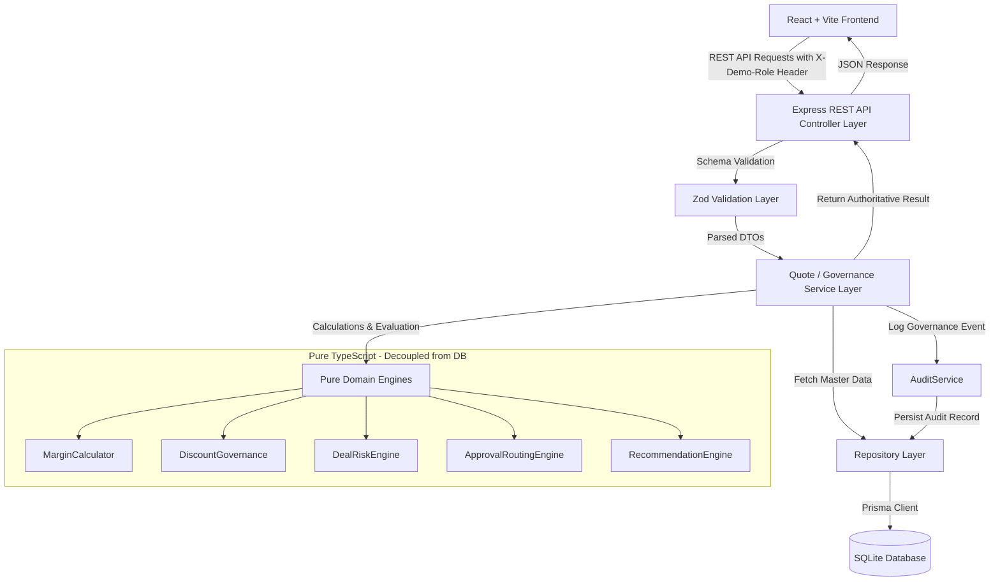

# DealFlow360 — System Architecture

## Overview
DealFlow360 is built as a modular monolithic architecture containing a decoupled **Node.js/Express TypeScript backend API** and a **React/Vite TypeScript frontend client**. It enforces strict backend governance where financial calculations, commercial policies, risk evaluations, and approval state transitions are executed exclusively on the server.

---

## 1. High-Level Architecture Diagram



---

## 2. Layering Architecture

### A. Presentation Layer (`/client`)
- Built with React 18, Vite, and Tailwind CSS.
- Displays live calculation feedback provided by backend response DTOs.
- Includes a **Demo Identity Switcher** to flip between `SALES_REP` and `SALES_MANAGER`.

### B. REST API & Middleware Layer (`/server/src/routes`, `/server/src/middleware`)
- Implements explicit REST endpoints for Customers, Products, Policies, Quotes, Approvals, Audit Logs, and Recommendations.
- **Authorization Middleware (`authMiddleware.ts`)**: Validates `X-Demo-Role` and `X-Demo-User-Id` headers. Restricts manager approval actions to `SALES_MANAGER`.
- **Validation Middleware (`validatePayload.ts`)**: Rejects invalid numeric formats, negative quantities, out-of-range discounts, or missing references using Zod schemas.

### C. Service Layer (`/server/src/services`)
- Coordinates transactional business logic.
- Executes domain engines in sequence:
  `INPUT -> VALIDATE -> MARGIN_CALCULATION -> GOVERNANCE_EVALUATION -> RISK_SCORE -> APPROVAL_ROUTING -> PERSISTENCE -> AUDIT`

### D. Pure Domain Engines (`/server/src/domain`)
- Independent pure functions/classes with ZERO dependencies on Prisma or SQLite.
- Fully unit-tested via Vitest.

### E. Data Access & Persistence (`/server/src/repositories`, `/server/src/db`)
- Interacts with SQLite via Prisma ORM (`prisma.schema`).
- Enforces relational foreign key integrity, transactions, and immutable audit entries.

---

## 3. Data Flow & Security Boundary

```
[Sales Rep] ──(1) Submit Quote Items (IDs, Quantities, Discounts)──> [Express Server]
                                                                          │
[Server] <──(2) Fetch Authoritative Unit Costs & List Prices─── [SQLite Database]
   │
   ├──(3) Compute Net Revenue, Cost, Gross Margin, Margin %
   ├──(4) Evaluate Customer Tier Discount Ceiling (e.g. Gold: 15%)
   ├──(5) Evaluate Category Discount Ceilings (e.g. Services: 10%)
   ├──(6) Calculate Multi-Factor Risk Score & Explainable Reasons
   ├──(7) Determine Approval State (AUTO_APPROVED vs APPROVAL_REQUIRED)
   │
   ├──(8) Transactionally Persist Quote + QuoteLines + ApprovalRequest ──> [SQLite DB]
   └──(9) Transactionally Record Immutable Audit Log Event ────────────> [SQLite DB]
```

---

## 4. Architectural Guarantees
1. **Zero Client Trust**: Discount rates, prices, margins, risk scores, and approval decisions cannot be manipulated by client requests.
2. **Deterministic & Explainable**: Every risk level (`LOW`, `MEDIUM`, `HIGH`) comes with concrete, rule-indexed explanations.
3. **Re-evaluation on Modification**: Modifying an `APPROVED` quote triggers re-evaluation. If new terms violate policy, status resets to `REVISION_REQUIRED` or `PENDING_APPROVAL`.
4. **Audit Integrity**: Governance events cannot be modified or deleted via public API routes.
